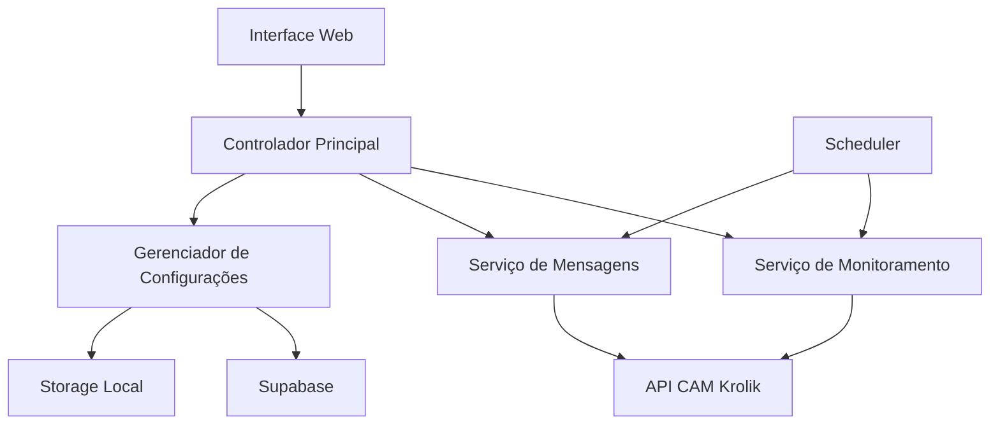

# Documento de Design - Automação de Mensagem de Espera

## Visão Geral

O sistema de automação de mensagens de espera é uma aplicação web que integra com a API do CAM Krolik para monitorar atendimentos em fila e enviar mensagens automáticas baseadas em regras de tempo. O sistema opera com dois fluxos principais: mensagens de 30 minutos para pacientes em espera prolongada e mensagens de fim de expediente às 18h.

### Decisões de Design Principais

1. **Arquitetura Baseada em Eventos**: O sistema utiliza timers e verificações periódicas para monitorar estados de atendimento
2. **Armazenamento Híbrido**: Supabase como storage principal com fallback para armazenamento local
3. **Interface Web Responsiva**: Painel HTML para gerenciamento sem necessidade de modificação de código
4. **Integração API Robusta**: Tratamento de erros e continuidade operacional mesmo com falhas pontuais

## Arquitetura

### Componentes Principais



### Fluxo de Dados

1. **Monitoramento Contínuo**: O scheduler executa verificações a cada minuto
2. **Coleta de Dados**: API do CAM Krolik fornece lista de atendimentos aguardando
3. **Processamento de Regras**: Sistema aplica regras de tempo e exceções
4. **Envio de Mensagens**: Mensagens são enviadas através dos canais configurados
5. **Persistência**: Estados são salvos no Supabase para evitar duplicações

## Componentes e Interfaces

### 1. Controlador Principal (MainController)

**Responsabilidades:**
- Coordenar todos os serviços
- Gerenciar ciclo de vida da aplicação
- Tratar erros globais

**Interface:**
```typescript
interface MainController {
  start(): Promise<void>
  stop(): Promise<void>
  getStatus(): SystemStatus
  pauseFlow(): void
  resumeFlow(): void
}
```

### 2. Serviço de Monitoramento (MonitoringService)

**Responsabilidades:**
- Verificar atendimentos em espera
- Calcular tempos de espera
- Identificar atendimentos elegíveis para mensagens

**Interface:**
```typescript
interface MonitoringService {
  checkWaitingPatients(): Promise<WaitingPatient[]>
  getPatientWaitTime(patientId: string): number
  isEligibleFor30MinMessage(patient: WaitingPatient): boolean
  isBusinessHours(): boolean
}
```

### 3. Serviço de Mensagens (MessageService)

**Responsabilidades:**
- Enviar mensagens através da API do CAM Krolik
- Gerenciar diferentes tipos de canal (normal vs API oficial)
- Aplicar filtros de exceção

**Interface:**
```typescript
interface MessageService {
  send30MinuteMessage(patient: WaitingPatient): Promise<boolean>
  sendEndOfDayMessages(patients: WaitingPatient[]): Promise<void>
  isChannelExcluded(channelId: string): boolean
  isSectorExcluded(sectorId: string): boolean
}
```

### 4. Gerenciador de Configurações (ConfigManager)

**Responsabilidades:**
- Gerenciar configurações do sistema
- Manter listas de exceção
- Persistir dados no Supabase

**Interface:**
```typescript
interface ConfigManager {
  getExcludedSectors(): string[]
  getExcludedChannels(): string[]
  addToExclusionList(attendanceId: string): Promise<void>
  isFlowPaused(): boolean
  cleanupDailyData(): Promise<void>
}
```

### 5. Cliente API CAM Krolik (KrolikApiClient)

**Responsabilidades:**
- Integrar com todos os endpoints necessários
- Tratar autenticação e erros de API
- Fornecer interface consistente para dados

**Interface:**
```typescript
interface KrolikApiClient {
  listWaitingAttendances(): Promise<Attendance[]>
  sendActionCard(chatId: string, cardId: string): Promise<boolean>
  sendTemplate(chatId: string, templateId: string): Promise<boolean>
  getSectors(): Promise<Sector[]>
  getActionCards(): Promise<ActionCard[]>
}
```

## Modelos de Dados

### Atendimento em Espera
```typescript
interface WaitingPatient {
  id: string
  name: string
  phone: string
  sectorId: string
  sectorName: string
  channelId: string
  channelType: 'normal' | 'api_oficial'
  waitStartTime: Date
  waitTimeMinutes: number
}
```

### Configuração do Sistema
```typescript
interface SystemConfig {
  flowPaused: boolean
  excludedSectors: string[]
  excludedChannels: string[]
  selectedActionCard?: string
  selectedTemplate?: string
  endOfDayTime: string // "18:00"
}
```

### Lista de Exclusão
```typescript
interface ExclusionEntry {
  attendanceId: string
  messageType: '30min' | 'end_of_day'
  sentAt: Date
  expiresAt: Date
}
```

## Tratamento de Erros

### Estratégias de Resiliência

1. **Falhas de API**: Sistema continua operando e registra erros para análise posterior
2. **Falhas de Supabase**: Fallback automático para armazenamento local
3. **Falhas de Envio**: Tentativas de reenvio com backoff exponencial
4. **Falhas de Rede**: Timeout configurável e retry automático

### Logging e Monitoramento

```typescript
interface ErrorHandler {
  logError(error: Error, context: string): void
  notifyAdministrator(criticalError: Error): void
  getErrorStats(): ErrorStatistics
}
```

## Estratégia de Testes

### Testes Unitários
- Cada serviço testado isoladamente
- Mocks para APIs externas
- Cobertura mínima de 80%

### Testes de Integração
- Fluxo completo de monitoramento e envio
- Integração com Supabase
- Cenários de falha e recuperação

### Testes End-to-End
- Interface web completa
- Fluxos de usuário principais
- Testes de responsividade

### Cenários de Teste Críticos

1. **Teste de 30 Minutos**: Verificar envio correto após tempo de espera
2. **Teste de Fim de Expediente**: Validar envio às 18h apenas em dias úteis
3. **Teste de Exceções**: Confirmar que setores/canais excluídos não recebem mensagens
4. **Teste de Duplicação**: Garantir que mensagens não sejam enviadas múltiplas vezes
5. **Teste de Falha de API**: Verificar continuidade operacional com APIs indisponíveis

## Interface do Usuário

### Painel Principal

**Seções:**
1. **Status do Sistema**: Indicador de fluxo ativo/pausado
2. **Atendimentos em Espera**: Lista em tempo real com filtros
3. **Configurações**: Gerenciamento de exceções e mensagens
4. **Logs**: Histórico de ações e erros

**Funcionalidades Interativas:**
- Pausar/Reativar fluxo com confirmação
- Adicionar/remover setores da lista de exceção
- Adicionar/remover canais da lista de exceção
- Selecionar cartões de ação e templates
- Visualizar estatísticas de envio

### Design Responsivo

- **Desktop**: Layout em colunas com sidebar de configurações
- **Tablet**: Layout adaptativo com navegação por abas
- **Mobile**: Interface simplificada com menu hambúrguer

## Considerações de Performance

### Otimizações

1. **Cache de Dados**: Setores e cartões de ação em cache local
2. **Polling Inteligente**: Frequência ajustável baseada na carga
3. **Batch Processing**: Envio de mensagens em lotes para eficiência
4. **Lazy Loading**: Interface carrega dados sob demanda

### Limites e Escalabilidade

- **Máximo de Atendimentos**: 10000 atendimentos simultâneos
- **Frequência de Verificação**: Mínimo de 30 segundos entre verificações
- **Timeout de API**: 10 segundos para requisições
- **Retenção de Logs**: 30 dias de histórico

## Segurança

### Autenticação e Autorização
- Tokens API armazenados de forma segura
- Validação de permissões para operações críticas
- Logs de auditoria para ações administrativas

### Proteção de Dados
- Dados pessoais minimizados (apenas nome e telefone necessários)
- Limpeza automática de dados temporários
- Criptografia em trânsito para comunicação com APIs