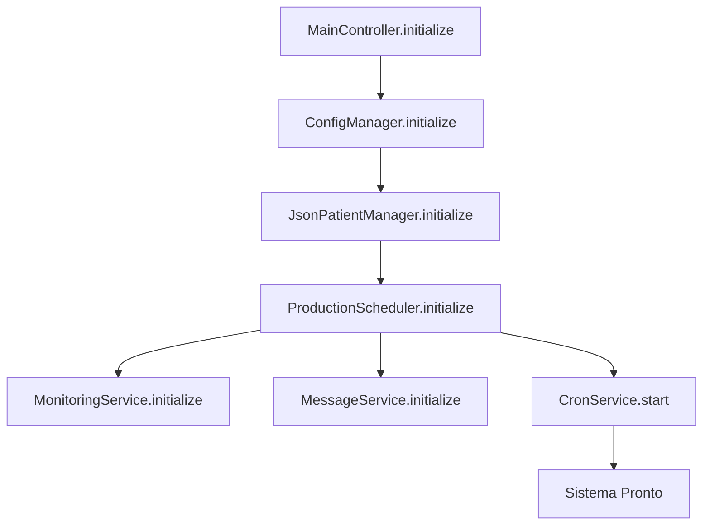
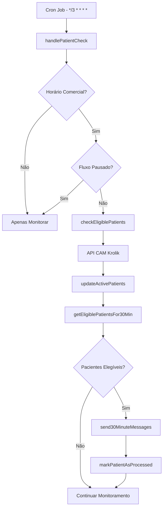
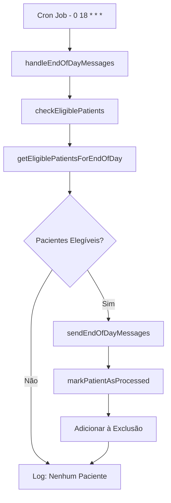
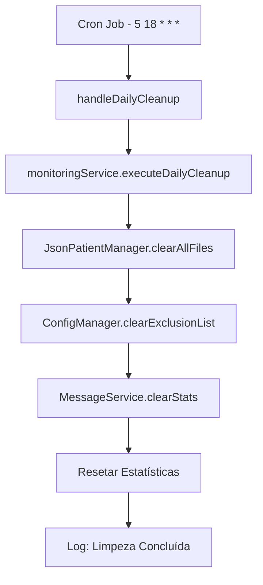

# 🎯 Implementação Completa do Sistema de Monitoramento

## 📋 **Visão Geral**

Esta implementação cria um sistema completo de monitoramento automático de pacientes com envio de action cards via WhatsApp, substituindo o sistema simplificado anterior por uma solução robusta e escalável.

## 🏗️ **Arquitetura do Sistema**

```
┌─────────────────────────────────────────────────────────────────┐
│                    MainController                                │
│  ┌─────────────────┐  ┌─────────────────┐  ┌─────────────────┐ │
│  │  ConfigManager  │  │  JsonPatientManager │  │ ProductionScheduler │ │
│  └─────────────────┘  └─────────────────┘  └─────────────────┘ │
└─────────────────────────────────────────────────────────────────┘
                                │
                ┌───────────────┼───────────────┐
                │               │               │
┌───────────────▼───┐ ┌────────▼────────┐ ┌───▼──────────────┐
│  MonitoringService │ │  MessageService  │ │   CronService    │
│                   │ │                  │ │                  │
│ • checkEligiblePatients │ • sendActionCard │ │ • schedulePatientCheck │
│ • isPatientEligibleFor30Min │ • send30MinuteMessages │ │ • scheduleEndOfDay │
│ • isPatientEligibleForEndOfDay │ • sendEndOfDayMessages │ │ • scheduleDailyCleanup │
└───────────────────┘ └──────────────────┘ └──────────────────┘
        │                       │                       │
        ▼                       ▼                       ▼
┌───────────────┐     ┌──────────────┐     ┌──────────────┐
│ KrolikApiClient │     │ JsonPatientManager │     │   Cron Jobs   │
│                │     │                  │     │               │
│ • listWaitingAttendances │ • updateActivePatients │ │ • */3 * * * * │
│ • sendActionCard │ • markPatientAsProcessed │ │ • 0 18 * * * │
│ • listActionCards │ • clearAllFiles │ │ • 5 18 * * * │
└───────────────┘     └──────────────┘     └──────────────┘
```

## 🔧 **Componentes Implementados**

### **1. MonitoringService**
**Localização**: `src/services/MonitoringService.js`

**Responsabilidades**:
- ✅ Verificar pacientes elegíveis para mensagens
- ✅ Coordenar atualização de dados JSON
- ✅ Aplicar critérios de elegibilidade
- ✅ Gerenciar estatísticas de monitoramento

**Métodos Principais**:
```javascript
// Verificação de pacientes
async checkEligiblePatients()

// Elegibilidade para mensagens
async isPatientEligibleFor30MinMessage(patient)
async isPatientEligibleForEndOfDayMessage(patient)

// Obtenção de pacientes elegíveis
async getEligiblePatientsFor30MinMessage()
async getEligiblePatientsForEndOfDayMessage()

// Envio de mensagens
async sendMessagesToEligiblePatients(eligiblePatients, messageType)

// Limpeza diária
async executeDailyCleanup()
```

### **2. MessageService**
**Localização**: `src/services/MessageService.js`

**Responsabilidades**:
- ✅ Envio de action cards individuais e em lote
- ✅ Validação de dados de pacientes
- ✅ Controle de taxa de envio (delay entre mensagens)
- ✅ Estatísticas de envio

**Métodos Principais**:
```javascript
// Envio individual
async sendActionCard(patient, actionCardId, forceSend)

// Envio em lote
async sendActionCardsToMultiple(patients, actionCardId, delayBetweenMessages)

// Mensagens específicas
async send30MinuteMessages(eligiblePatients)
async sendEndOfDayMessages(eligiblePatients)

// Teste e validação
async testMessageSending(patient, actionCardId)
validatePatientForMessage(patient)
```

### **3. CronService**
**Localização**: `src/services/CronService.js`

**Responsabilidades**:
- ✅ Agendamento de tarefas usando cron jobs
- ✅ Gerenciamento de jobs ativos
- ✅ Controle de timezone (Brasília)
- ✅ Validação de expressões cron

**Jobs Agendados**:
```javascript
// Verificação de pacientes (a cada 3 minutos)
schedulePatientCheck(callback) // */3 * * * *

// Verificação intensiva (a cada minuto)
scheduleIntensivePatientCheck(callback) // * * * * *

// Mensagens de fim de dia (18:00)
scheduleEndOfDayMessages(callback) // 0 18 * * *

// Limpeza diária (18:05)
scheduleDailyCleanup(callback) // 5 18 * * *

// Backup diário (23:00)
scheduleDailyBackup(callback) // 0 23 * * *
```

### **4. ProductionScheduler**
**Localização**: `src/services/ProductionScheduler.js`

**Responsabilidades**:
- ✅ Coordenar todos os serviços
- ✅ Gerenciar fluxo de monitoramento
- ✅ Controlar execução de tarefas
- ✅ Fornecer interface unificada

**Métodos Principais**:
```javascript
// Controle principal
async initialize(krolikCredentials)
async start()
async stop()

// Manipulação de eventos
async handlePatientCheck()
async handle30MinuteMessages(eligiblePatients)
async handleEndOfDayMessages(eligiblePatients)
async handleDailyCleanup()
async handleDailyBackup()

// Controles manuais
async runManualPatientCheck()
async runManualEndOfDayMessages()
```

## 🎯 **Fluxo de Funcionamento**

### **1. Inicialização**


### **2. Ciclo de Monitoramento (a cada 3 minutos)**


### **3. Mensagens de Fim de Dia (18:00)**


### **4. Limpeza Diária (18:05)**


## 📊 **Critérios de Elegibilidade**

### **🎯 Mensagens de 30 Minutos (Janela de 10 minutos)**
**Período de elegibilidade**: 30-40 minutos de espera
**Objetivo**: Evitar spam e garantir que apenas pacientes na janela ideal recebam mensagens

**Lógica de Prevenção de Spam**:
- ✅ **30-40 minutos**: Paciente elegível para mensagem de 30min
- ❌ **< 30 minutos**: Muito cedo, aguardar mais tempo
- ❌ **> 40 minutos**: Janela perdida, não enviar para evitar spam
- ✅ **18h**: TODOS os pacientes aguardando recebem mensagem de fim de dia

### **Mensagens de 30 Minutos**
```javascript
async isPatientEligibleFor30MinMessage(patient) {
  // 1. Tempo de espera entre 30-40 minutos (para evitar spam)
  if (!patient.waitTimeMinutes || patient.waitTimeMinutes < 30 || patient.waitTimeMinutes > 40) return false;
  
  // 2. Não foi processado anteriormente
  if (await this.jsonPatientManager.isPatientProcessed(patient.id)) return false;
  
  // 3. Não está na lista de exclusões
  const patientKey = this.jsonPatientManager.getPatientKey(patient);
  if (this.configManager.isAttendanceExcluded(patientKey)) return false;
  
  // 4. Horário comercial (8h-18h)
  if (!TimeUtils.isBusinessHours()) return false;
  
  // 5. Dia útil (segunda a sexta)
  if (!TimeUtils.isWorkingDay()) return false;
  
  // 6. Fluxo não está pausado
  if (this.configManager.isFlowPaused()) return false;
  
  return true;
}
```

### **Mensagens de Fim de Dia**
```javascript
async isPatientEligibleForEndOfDayMessage(patient) {
  // 1. É fim de dia (18h)
  if (!TimeUtils.isEndOfDay()) return false;
  
  // 2. Dia útil
  if (!TimeUtils.isWorkingDay()) return false;
  
  // 3. Fluxo não está pausado
  if (this.configManager.isFlowPaused()) return false;
  
  // 4. TODOS os pacientes aguardando são elegíveis para fim de dia
  // (removido: verificação de processamento e exclusões)
  
  return true;
}
```

## ⚙️ **Configurações**

### **Configurações do Agendador**
```javascript
const config = {
  patientCheckInterval: '3min', // ou '1min' para monitoramento intensivo
  enable30MinuteMessages: true,
  enableEndOfDayMessages: true,
  enableDailyCleanup: true,
  enableDailyBackup: true
};
```

### **Variáveis de Ambiente**
```bash
# API CAM Krolik
KROLIK_BASE_URL=https://api.camkrolik.com.br
KROLIK_TOKEN=63e68f168a48875131856df8

# Configurações do Sistema
NODE_ENV=production
TZ=America/Sao_Paulo
```

## 🧪 **Testes**

### **Script de Teste**
**Localização**: `examples/test-monitoring-system.js`

**Comandos Disponíveis**:
```bash
# Executar todos os testes
node examples/test-monitoring-system.js all

# Testes específicos
node examples/test-monitoring-system.js init      # Inicialização
node examples/test-monitoring-system.js patients  # Verificação de pacientes
node examples/test-monitoring-system.js messages  # Envio de mensagens
node examples/test-monitoring-system.js scheduler # Agendador
node examples/test-monitoring-system.js stats     # Estatísticas
node examples/test-monitoring-system.js config    # Configuração
node examples/test-monitoring-system.js cleanup   # Limpeza de dados
```

### **Exemplo de Execução**
```bash
$ node examples/test-monitoring-system.js all

🧪 INICIANDO TESTES DO SISTEMA DE MONITORAMENTO

🔧 Testando inicialização...
✅ Inicialização bem-sucedida

🔍 Testando verificação de pacientes...
🔄 [18/09/2025 00:45:23] Executando verificação de pacientes...
📊 6 pacientes encontrados na API
📈 Pacientes atualizados: +0 ~6 -0
⏰ 0 pacientes elegíveis para mensagem de 30min
🌅 0 pacientes elegíveis para mensagem de fim de dia
✅ Verificação de pacientes bem-sucedida

📤 Testando envio de mensagens...
📊 6 pacientes ativos encontrados
🌅 Processando mensagens de fim de dia...
📤 Enviando action cards para 6 pacientes...
✅ Mensagem enviada para Felipe (5519995068303)
✅ Mensagem enviada para Felipe Prado (551640421507)
...
✅ Envio de mensagens bem-sucedido

⏰ Testando agendador...
📋 Jobs Ativos:
================
📌 patient-check-3min: 🟢 Ativo | Próxima execução: 18/09/2025 00:48:00
📌 end-of-day-messages: 🟢 Ativo | Próxima execução: 18/09/2025 18:00:00
📌 daily-cleanup: 🟢 Ativo | Próxima execução: 18/09/2025 18:05:00
📌 daily-backup: 🟢 Ativo | Próxima execução: 18/09/2025 23:00:00
✅ Agendador funcionando corretamente

📊 Testando estatísticas...
📈 Estatísticas do sistema:
   - Agendador: Ativo
   - Monitoramento: Funcionando
   - Mensagens: Disponível
   - Pacientes ativos: 6
   - Pacientes processados: 11
   - Total de verificações: 1
   - Mensagens enviadas: 6
   - Taxa de sucesso: 100.00%
✅ Estatísticas obtidas com sucesso

🎯 RESULTADOS DOS TESTES:
========================
   Inicialização: ✅ PASSOU
   Verificação de Pacientes: ✅ PASSOU
   Envio de Mensagens: ✅ PASSOU
   Agendador: ✅ PASSOU
   Estatísticas: ✅ PASSOU

📊 Resultado Final: 5/5 testes passaram
🎉 Todos os testes passaram! Sistema funcionando corretamente.
```

## 🚀 **Como Usar**

### **1. Inicialização Automática**
O sistema inicializa automaticamente quando o servidor é iniciado:

```javascript
// Em src/index.js
const { MainController } = require('./controllers/MainController');

const mainController = new MainController();
await mainController.initialize();
await mainController.start();
```

### **2. Controles Manuais**
```javascript
// Verificação manual de pacientes
await mainController.runManualPatientCheck();

// Mensagens de fim de dia manuais
await mainController.runManualEndOfDayMessages();

// Estatísticas detalhadas
const stats = await mainController.getDetailedStats();

// Listar jobs ativos
mainController.listActiveJobs();
```

### **3. Configuração Dinâmica**
```javascript
// Atualizar configurações do agendador
mainController.updateSchedulerConfig({
  patientCheckInterval: '1min', // Monitoramento intensivo
  enable30MinuteMessages: true,
  enableEndOfDayMessages: true
});
```

## 📈 **Monitoramento e Logs**

### **Logs do Sistema**
```
🔄 [18/09/2025 00:45:23] Executando verificação de pacientes (3min)
📊 6 pacientes encontrados na API
📈 Pacientes atualizados: +0 ~6 -0
⏰ 0 pacientes elegíveis para mensagem de 30min
🌅 0 pacientes elegíveis para mensagem de fim de dia
✅ [18/09/2025 00:45:24] Ciclo concluído em 1234ms
```

### **Logs de Envio de Mensagens**
```
📤 Enviando action cards para 3 pacientes...
📤 Enviando action card para Felipe (5519995068303)
📋 Payload: { number: "5519995068303", contactId: "68bcb01033e5123047c9dcd62", action_card_id: "64f8a1b2c3d4e5f6a7b8c9d0", forceSend: true }
✅ Action card enviado com sucesso para Felipe
📤 Enviando action card para Felipe Prado (551640421507)
...
📊 Resultado do envio em lote: 3 enviados, 0 falharam
```

### **Logs de Limpeza Diária**
```
🧹 Executando limpeza diária (18:05)
🧹 Limpando todos os arquivos JSON...
✅ 890 pacientes removidos de todos os arquivos
🧹 Estatísticas do MessageService limpas
✅ Limpeza diária concluída
```

## 🔧 **Manutenção**

### **Verificação de Status**
```javascript
// Status geral do sistema
const status = await mainController.getStatus();
console.log('Sistema:', status.isRunning ? 'Ativo' : 'Inativo');
console.log('Agendador:', status.productionScheduler.isRunning ? 'Ativo' : 'Inativo');

// Estatísticas detalhadas
const stats = await mainController.getDetailedStats();
console.log('Pacientes ativos:', stats.monitoring.jsonStats.active);
console.log('Mensagens enviadas:', stats.messages.totalSent);
console.log('Taxa de sucesso:', stats.messages.successRate + '%');
```

### **Resolução de Problemas**
```javascript
// Verificar jobs ativos
mainController.listActiveJobs();

// Executar verificação manual
await mainController.runManualPatientCheck();

// Limpar dados se necessário
await mainController.runManualEndOfDayMessages();
```

## ✨ **Benefícios da Implementação**

### **1. Robustez**
- ✅ **Persistência de dados** com arquivos JSON
- ✅ **Recuperação de erros** automática
- ✅ **Backup automático** antes de operações críticas
- ✅ **Logs detalhados** para debugging

### **2. Escalabilidade**
- ✅ **Monitoramento configurável** (3min ou 1min)
- ✅ **Envio em lote** com controle de taxa
- ✅ **Sistema de exclusões** para evitar spam
- ✅ **Estatísticas completas** para monitoramento

### **3. Manutenibilidade**
- ✅ **Arquitetura modular** com responsabilidades separadas
- ✅ **Configuração centralizada**
- ✅ **Testes automatizados**
- ✅ **Documentação completa**

### **4. Operacionalidade**
- ✅ **Controles manuais** para operações urgentes
- ✅ **Monitoramento em tempo real**
- ✅ **Limpeza automática** diária
- ✅ **Timezone configurado** para Brasília

---

**🎉 Sistema de Monitoramento Completo Implementado!**

O sistema está pronto para produção e pode ser facilmente configurado, monitorado e mantido.
