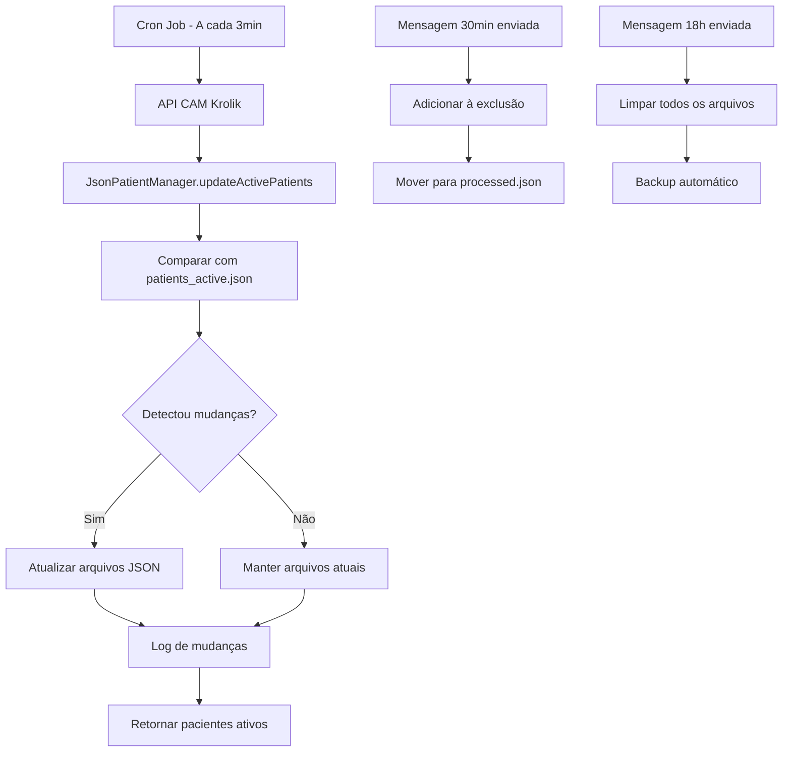

# 📁 JsonPatientManager - Gerenciamento de Pacientes em Arquivos JSON

## 🎯 **Visão Geral**

O `JsonPatientManager` substitui o sistema de cache em RAM por uma solução persistente baseada em arquivos JSON, garantindo que os dados de pacientes sejam mantidos mesmo após reinicializações do servidor.

## 📋 **Funcionalidades Implementadas**

### ✅ **1. Arquivos JSON Separados**
```
📁 data/
├── 📄 patients_active.json      # Pacientes aguardando agora
├── 📄 patients_processed.json   # Pacientes que saíram/receberam mensagens
├── 📄 patients_history.json     # Histórico do dia (limpo às 18h)
└── 📄 patients_backup.json      # Backup de segurança
```

### ✅ **2. Detecção de Mudanças**
- **Chave única**: `nome + telefone + setor`
- **Pacientes diferentes**: Qualquer campo diferente = paciente diferente
- **Comparação inteligente**: Detecta novos, removidos e atualizados

### ✅ **3. Movimentação Automática**
- **Paciente entra** → `patients_active.json`
- **Paciente recebe 30min** → `patients_processed.json` (remove de active)
- **Paciente recebe 18h** → `patients_processed.json` (remove de active)
- **Paciente é atendido** → `patients_processed.json` (remove de active)

### ✅ **4. Limpeza Automática**
- **Após mensagens de 18h**: Todos os arquivos são limpos
- **Backup automático**: Antes de operações críticas
- **Recuperação de erros**: Arquivos corrompidos são recriados

### ✅ **5. Integração com Sistema Atual**
- **Compatível** com sistema de exclusões existente
- **Nova chave de exclusão**: `nome_telefone_setor`
- **API de status** continua funcionando
- **Interface web** não alterada

## 🔧 **Alterações Técnicas**

### **MonitoringService**
- ❌ Removido: `cachedPatients: Map<string, WaitingPatient>`
- ✅ Adicionado: `JsonPatientManager` integration
- ✅ Novos métodos: `initialize()`, `clearAllData()`
- ✅ Métodos assíncronos: `getPatientWaitTime()`, `getMonitoringStats()`

### **CronService**
- ✅ Intervalo alterado: `*/3 * * * *` (a cada 3 minutos)

### **ProductionScheduler**
- ✅ Limpeza automática após mensagens de 18h

### **MessageService**
- ✅ Nova chave de exclusão: `nome_telefone_setor`

## 📊 **Fluxo de Funcionamento**



## 🚀 **Como Usar**

### **1. Inicialização Automática**
O sistema inicializa automaticamente quando o servidor é iniciado:

```typescript
// Em MainController.initialize()
await this.monitoringService.initialize(); // Inicializa JsonPatientManager
```

### **2. Verificação de Arquivos**
```bash
# Verificar arquivos criados
ls -la data/

# Verificar conteúdo
cat data/patients_active.json
```

### **3. Teste da Funcionalidade**
```bash
# Executar teste
node examples/test-json-patient-manager.js
```

## 📈 **Vantagens da Nova Implementação**

### ✅ **Persistência**
- Dados mantidos após reinicialização
- Backup automático antes de operações críticas
- Recuperação de arquivos corrompidos

### ✅ **Rastreabilidade**
- Histórico completo de pacientes
- Timestamp de entrada na lista
- Logs detalhados de mudanças

### ✅ **Performance**
- Cache de 30 segundos mantido para operações frequentes
- Comparação inteligente evita operações desnecessárias
- Backup apenas quando necessário

### ✅ **Confiabilidade**
- Sistema de fallback em caso de erros
- Validação de dados antes de salvar
- Limpeza automática previne acúmulo

## 🔍 **Monitoramento**

### **Logs do Sistema**
```
📥 3 novos pacientes adicionados
📤 2 pacientes removidos (atendidos)
🧹 Todos os dados de pacientes foram limpos após mensagens de fim de expediente
```

### **API de Status**
```json
{
  "monitoring": {
    "isRunning": true,
    "interval": 180000,
    "stats": {
      "totalPatients": 15,
      "patientsOver30Min": 3,
      "averageWaitTime": 25
    }
  }
}
```

### **Arquivos JSON**
```json
// patients_active.json
[
  {
    "id": "attendance-001",
    "name": "João Silva",
    "phone": "11999999999",
    "sectorId": "cardiologia",
    "waitTimeMinutes": 35,
    "enteredAt": "2024-01-15T10:30:00.000Z"
  }
]
```

## ⚠️ **Considerações Importantes**

### **1. Espaço em Disco**
- Arquivos JSON crescem conforme número de pacientes
- Limpeza automática às 18h previne acúmulo excessivo
- Backup automático pode usar espaço adicional

### **2. Performance**
- Comparação de listas pode ser lenta com muitos pacientes
- Operações de I/O são mais lentas que RAM
- Cache de 30s reduz impacto na performance

### **3. Concorrência**
- Arquivos são lidos/escritos sequencialmente
- Backup automático antes de operações críticas
- Tratamento de erros previne corrupção

## 🧪 **Testes**

### **Teste Manual**
```bash
# 1. Iniciar servidor
npm start

# 2. Executar teste
node examples/test-json-patient-manager.js

# 3. Verificar arquivos
ls -la data/
```

### **Teste de Recuperação**
```bash
# 1. Corromper arquivo
echo "invalid json" > data/patients_active.json

# 2. Reiniciar servidor
npm restart

# 3. Verificar se arquivo foi recriado
cat data/patients_active.json
```

## 📝 **Logs e Debugging**

### **Logs Importantes**
- `📁 JsonPatientManager inicializado com sucesso`
- `📥 X novos pacientes adicionados`
- `📤 X pacientes removidos (atendidos)`
- `🧹 Todos os arquivos de pacientes foram limpos`

### **Debugging**
```typescript
// Verificar estatísticas
const stats = await jsonPatientManager.getStats();
console.log('Stats:', stats);

// Verificar pacientes ativos
const active = await jsonPatientManager.getActivePatients();
console.log('Active patients:', active.length);
```

---

**🎉 Implementação concluída com sucesso!**

O sistema agora usa arquivos JSON para persistência, mantendo todas as funcionalidades existentes e adicionando maior confiabilidade e rastreabilidade.
